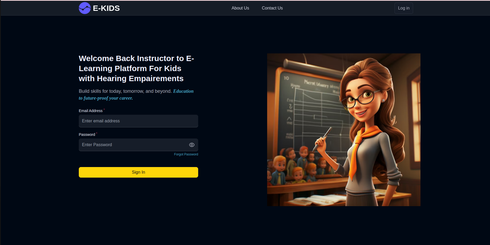
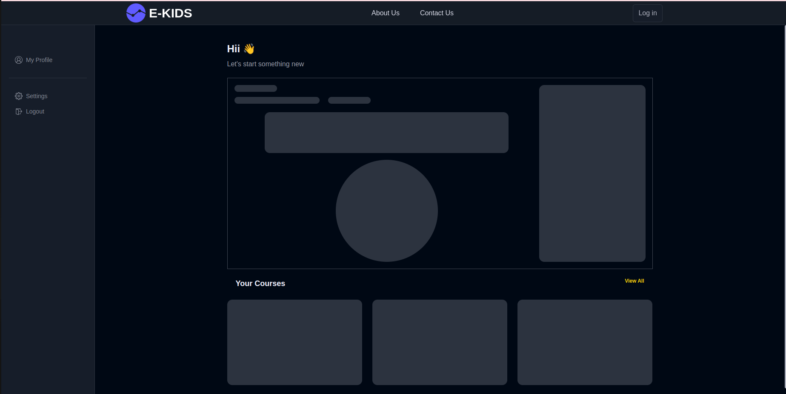
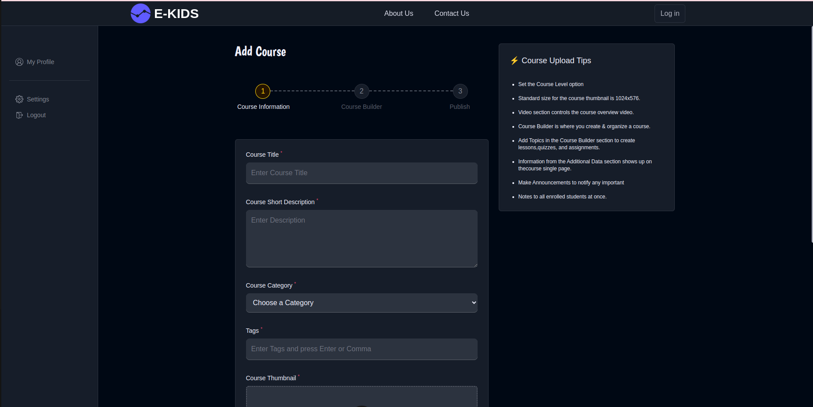
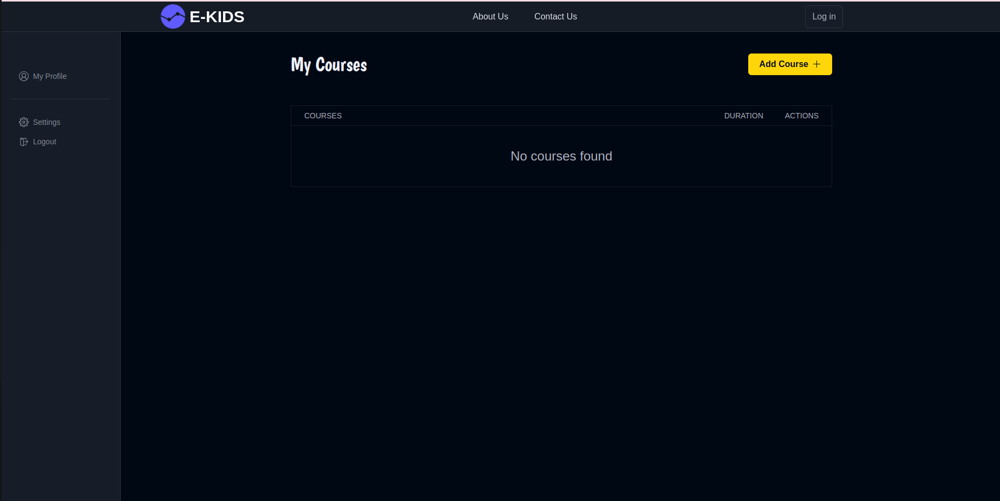

# smart-learning-instructor-dashboard-panel
A ReactJS dashboard for instructors on the Smart Learning Platform for hearing-impaired kids. Features include lesson uploads, progress tracking, and student interaction.

## 📸 Login Page Screenshot

## 📸 Instructor Dashboard Page Screenshot

## 📸 Add courses Dashboard Page Screenshot

## 📸 My courses Page Screenshot

